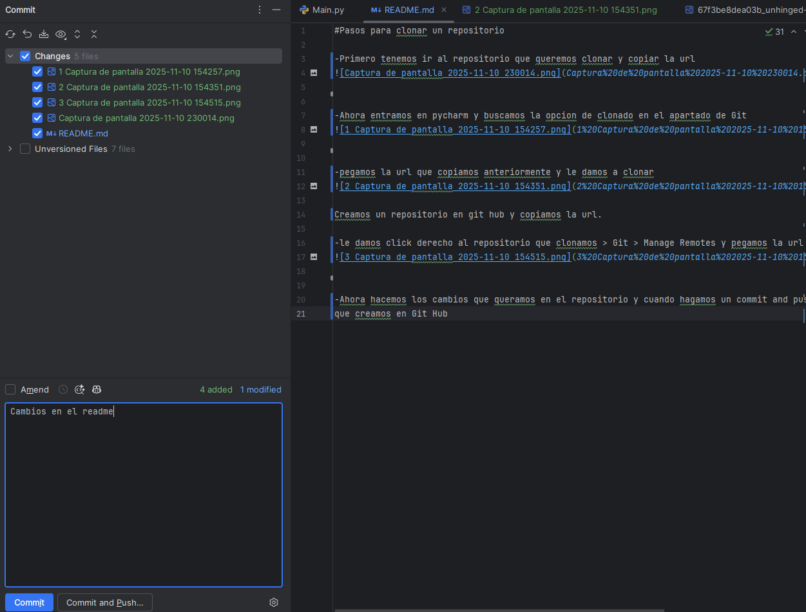

#Pasos para clonar un repositorio

-Primero tenemos ir al repositorio que queremos clonar y copiar la url

-Ahora entramos en pycharm y buscamos la opcion de clonado en el apartado de Git

-pegamos la url que copiamos anteriormente y le damos a clonar

Creamos un repositorio en git hub y copiamos la url.

-le damos click derecho al repositorio que clonamos > Git > Manage Remotes y pegamos la url del repositorio que creamos en git 

-Ahora hacemos los cambios que queramos en el repositorio y cuando hagamos un commit and push lo mandara todo al repositorio
que creamos en Git Hub

